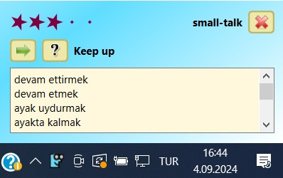
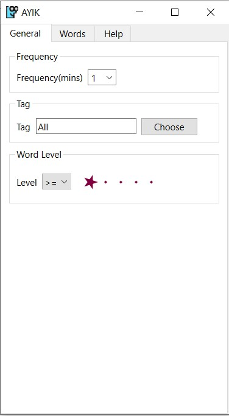
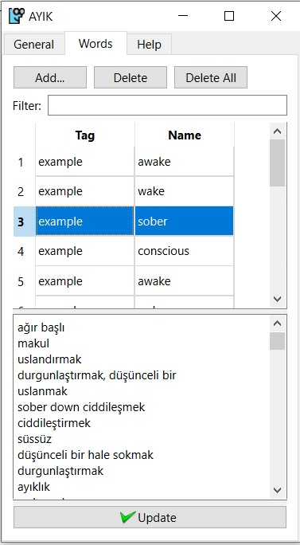
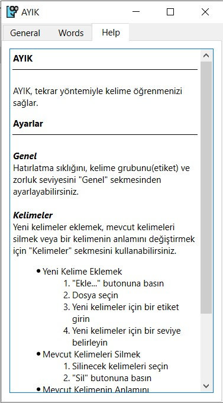

# AYIK

This is a vocabulary builder application that helps you learn new words in English. 
Main target is Turkish users striving for memorizing English words. The application runs on system tray and according to a schedule you set, it will randomly as a word on the screen.

Note that codebase needs some maintenance in regard to code quality, e.g. dead codes, inconsistent usages, etc. 

## Tech Stack
C++, QT, Sqlite

## Screenshots

### System Tray and Main Screen

### Settings - General

### Settings - Words

### Settings - Help

